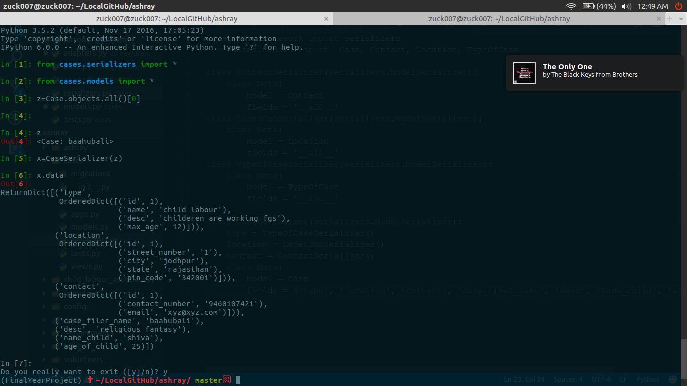

# Installation
```
$ git clone https://github.com/team-mbm/ashray.git
$ workon myfinalyearproject
$ pip install -r requirements/local.txt
$ pip install djangorestframework
```
## Snapshot
* Cases api shell test 

