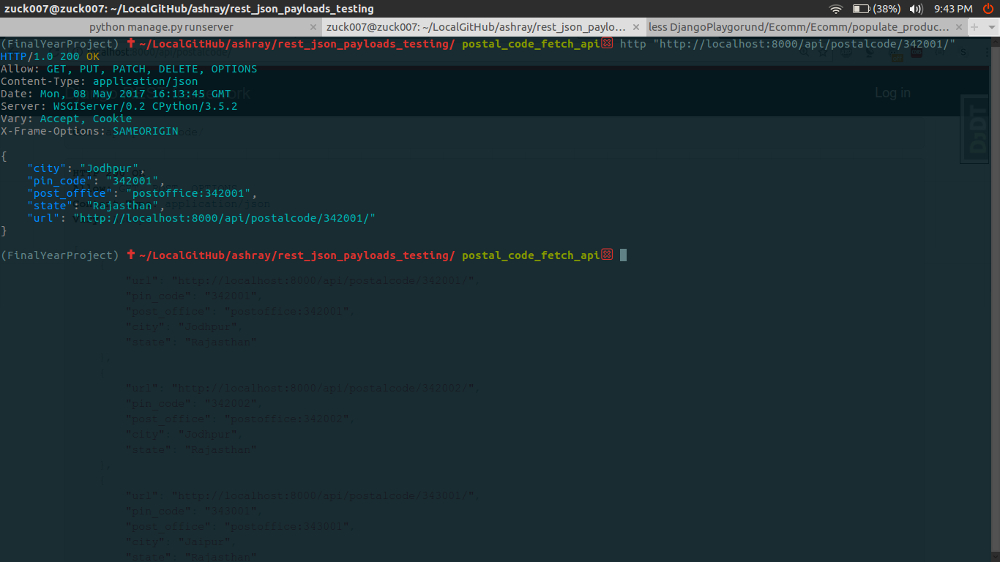

# Installation
```
$ git clone https://github.com/team-mbm/ashray.git
$ workon myfinalyearproject
$ pip install -r zuck_requirements.txt
```
## Filling postal code
* 
## Snapshot
* Postal code sample get request via http://api_link/pin_code

